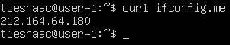
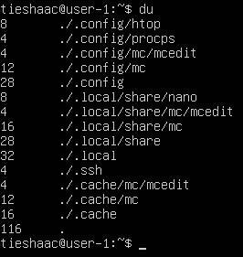

## Part 1. Установка OC

`Просмотр версии Ubuntu после установки:`  
 

## Part 2. Создание пользователя

`Создание нового пользователя под названием "aldolois" и добавление его в группу adm:`  
 

`Вывод команды "cat /etc/passwd" показывает наличие нового пользователя в конце списка:`  
 

## Part 3. Настройка сети ОС

 `Установка нового имени машины вида user-1 и вывод его в терминал:`  
 

 `Установка и вывод временной зоны по текущему местоположению:`  
 

 `Установка виртуальных интерфейсов:`  
 

 `Вывод виртуальных интерфейсов:`  
 

Интерфейс **lo** - виртуальный интерфейс, который используется для обратной петли (loopback), позволяет устройству обращаться к самому себе через сетевой стек без необходимости использования физического сетевого интерфейса. Имеет IP-адрес 127.0.0.1 и обычно имеет маску подсети 255.0.0.0. Он используется для различных целей, включая тестирование сетевых приложений, проверку работоспособности сетевого стека и доступ к локальным ресурсам без необходимости использования физической сети. 

 `Получение ip адреса устройства от DHCP сервера:`  

**DHCP** (Dynamic Host Configuration Protocol англ.) — протокол динамической настройки узла, позволяющий устройствам автоматически получать IP-адрес, данные о DNS-сервере и другие параметры, необходимые для работы в сети.

`Вывод внешнего ip-адреса шлюза (ip):` 

 `Получение внутреннего IP-адреса шлюза (он же ip-адрес по умолчанию (gw)):`  

`Открыли с правами администратора файл /etc/netplan/*.yaml:`  
 

`Присвоили значение false для dhcp4 и добавили строки с адресами после него:`  
 

`Применили изменения в netplan, перезагрузились:`  
 

`Проверяем, что сетевые настройки соответствуют заданным в предыдущем пункте:`  
 

`Успешно пропинговали удаленные хосты 1.1.1.1 и ya.ru:`  
 

## Part 4. Обновление ОС

`Успешно обновили пакеты ОС до последней версии:`  
 

## Part 5. Использование команды **sudo**

Команда **sudo** используется для выполнения команд с привилегиями суперпользователя (root), позволяет обычному пользователю получить временные привилегии администратора для выполнения задач, которые требуют повышенных прав доступа. 

`Меняем hostname ОС от имени пользователя, созданного в пункте Part 2 (используя sudo).` 

## Part 6. Установка и настройка службы времени

`Успешно обновили пакеты ОС до последней версии:`  

 

## Part 7. Установка и использование текстовых редакторов

`В VIM для выхода с сохранением ввёл :wq, имя файла и подтвердил нажатием Enter` 
 

`В NANO для выхода с сохранением нажал ^X, ответил "Y" для сохранения, ввёл имя файла и подтвердил нажатием Enter` 
 

`В MCEDIT для сохранения воспользовался нажатием F2, ввёл имя файла и подтвердил нажатием Enter, для выхода нажал F10` 
 

`В VIM для выхода без сохранения ввёл :q! и подтвердил нажатием Enter` 
 

`В NANO для выхода без сохранения воспользовался нажатием ^X, ответил "No" на вопрос о сохранении и подтвердил нажатием Enter` 
 

`В MCEDIT для выхода без сохранения воспользовался нажатием F10, ответил "No" на вопрос о сохранении и подтвердил нажатием Enter` 
 

`В VIM для поиска воспользовался командой /что_ищем:` 
 

`В VIM для замены воспользовался командой :s/что_ищем/чем_заменяем и подтвердил нажатием Enter:` 
 

`В NANO для поиска воспользовался нажатием ^W` 
 

`В NANO для замены воспользовался нажатием ^\, далее ввёл искомый текст, после ввёл то, чем его заменить и подтвердил ответом "YES"` 
 

`В MCEDIT для поиска перевел каретку в начало файла и воспользовался нажатием F7, далее ввёл искомый текст и подтвердил нажатием Enter` 
 

`В MCEDIT для замены перевёл каретку в начало файла и воспользовался нажатием F4, далее ввёл искомый текст и то чем его заменить, подтвердил нажатием Enter и ещё раз согласился с заменой` 
 

## Part 8. Установка и базовая настройка сервиса **SSHD**

`Устанавливаем службу SSHd:` 
 

`Установим автостарт службы SSHd при загрузке системы и проверим её статус:`
 

`Для перенастройки службы SSHd на порт 2022 отредактируем файл с повышенными правами "Перенастройка службы SSHd`
 

`Перезапускаем sshd systemctl restart sshd.`

`Показываем наличие процесса sshd, используя команду ps с ключом -e или -A:` 
 
    
Команда **ps**  показывает запущенные процессы, выполняемые пользователем в окне терминала. 
* **-e** или **-A** - отображает информацию о всех процессах в системе. 
* **| grep sshd** - ищет и выводит только нужное значение по выводу команды ps

`Для перезагрузки системы используем команду: reboot` 
 

`Вывод команды netstat -tan:` 
 

Команда **netstat -tan** используется для отображения активных сетевых соединений на компьютере. Значение ключей:

* -t - отображает только TCP-соединения.
* -a - отображает все соединения, включая прослушивающие порты.
* -n - отображает адреса и порты в числовом формате, а не в виде имен.

Значение столбцов вывода команды **netstat -tan**:
* **Proto** - тип протокола, используемый для соединения (TCP или UDP).
* **Recv-Q**- размер очереди приема (в байтах) для соединения.
* **Send-Q**- размер очереди отправки (в байтах) для соединения.
* **Local Address**- локальный IP-адрес и порт, используемые для соединения.
* **Foreign Address**- удаленный IP-адрес и порт, с которым установлено соединение.
* **State**: текущее состояние соединения, в данном случае
"LISTEN" (ожидание входящих соединений).
* **0.0.0.0**- соединение прослушивается на всех доступных сетевых интерфейсах, включая IPv4 и IPv6 адреса,  используется в качестве адреса по умолчанию или адреса-заполнителя.
* **0.0.0.0:2022**- сервер прослушивает входящие соединения на порту 2022 на всех доступных IP-адресах.

## Part 9. Установка и использование утилит **top**, **htop**

`Вывод команды top:`
- **uptime**: 2:06 (2 чвса 6 минут)
- **количество авторизованных пользователей**: 1
- **общую загрузку системы**: 0.00, 0.00, 0.00
- **общее количество процессов**: 119
- **загрузку cpu**: 0.0
- **загрузку памяти**: 3919.5
- **pid процесса занимающего больше всего памяти**: 1
- **pid процесса, занимающего больше всего процессорного времени**: 1

 

`Вывод команды htop отсортированный по PID:` 
 

`Вывод команды htop отсортированный по PERCENT_CPU:` 
 

`Вывод команды htop отсортированный по PERCENT_MEM:` 
 

`Вывод команды htop отсортированный по TIME:` 
 

`Вывод команды htop отфильтрованный для процесса sshd:` 
 

`Вывод команды htop с процессом syslog, найденным, используя поиск:` 
 

`Добавляем вывод hostname, clock и uptime через F2 команду Setup:` 
 

`Вывод команды htop с добавленным выводом hostname, clock и uptime:` 
 

## Part 10. Использование утилиты **fdisk**

`Вывод команды fdisk -l:` 
 

`Вывод команды fdisk -l показывает:`
* **название жесткого диска**: VBOX HARDDISK;
* **размер**: 18.1 GiB;
* **количество секторов**: 37760672 sectors; 

`Вывод размера swap:` 
 

## Part 11. Использование утилиты **df** 

Вывод команды **df** для корневого раздела (/):
* **размер раздела**: 10218772
* **размер занятого пространства**: 2797064
* **размер свободного пространства**: 6881036
* **процент использования**: 29% 
* **единица измерения**: килобайт

") 

Вывод команды **df -Th** для корневого раздела (/):
* **размер раздела**: 9.8G
* **размер занятого пространства**: 2.7G
* **размер свободного пространства**: 6.6G
* **процент использования**: 29%
* **тип файловой системы**: ext4

") 

## Part 12. Использование утилиты **du**

`Запускаем команду du:` 
 

`Выводим размер папок /home, /var, /var/log (в байтах, в человекочитаемом виде):` 
") 

`Выводим размер всего содержимого в /var/log (не общее, а каждого вложенного элемента, используя *):` 
") 

## Part 13. Установка и использование утилиты **ncdu**

`Установили утилиту ncdu:` 
 

`Выведем размер /home с помощью команды "sudo ncdu /" (с повышенyыми правами):` 
 

`Выведем размер /var с помощью команды "sudo ncdu /" (с повышенyыми правами):` 
 

`Выведем размер /var/log/ с помощью команды "sudo ncdu /var/" (с повышенyыми правами):` 
 

## Part 14. Работа с системными журналами

**Время последней успешной авторизации**: 14 Jan 17:36:35 
**Имя пользователя**: tieshaac 
**Метод входа в систему**: login 

 

`Перезапустили службу SSHd:` 
 

`Сообщение о рестарте службы SSHd (в логах):` 
") 

## Part 15. Использование планировщика заданий **CRON**

`Через команду "crontab -e", добавим задание на выполнение команды uptime через каждые 2 минуты, добавив "*/2 * * * * uptime" в планировщик посредством редактора NANO:` 
 

`Строчки из лога о выполнении команды uptime:` 
 

`Выведим на экран список текущих заданий для CRON:` 
 

`Удалив все задания из планировщика заданий и после вывода списка текущих заданий, увидим, что он пуст:` 
